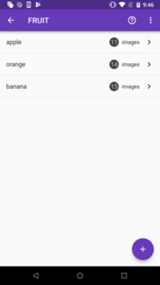
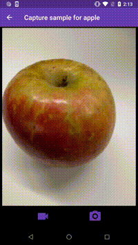
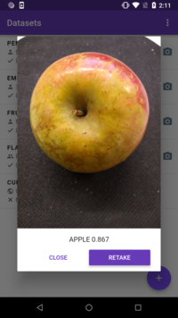

# Custom Image Classifier

If you want a custom image classifier, but don’t have the right data or the know-how to build it, you’ve come to the right place. With this Flutter app (runs on both iOS and Android) you can create datasets, collaborate on the collection of training data, and then trigger the training of the custom image classifier from the device. Once the classifier is ready, you can use it from the same app, and run inferences on device.

 &nbsp;&nbsp;&nbsp;&nbsp;&nbsp;&nbsp;  &nbsp;&nbsp;&nbsp;&nbsp;&nbsp;&nbsp;  

&nbsp;&nbsp;&nbsp;&nbsp;&nbsp;&nbsp;&nbsp; *Create Datasets* &nbsp;&nbsp;&nbsp;&nbsp;&nbsp;&nbsp;&nbsp; &nbsp;&nbsp;&nbsp;&nbsp;&nbsp;&nbsp;&nbsp;&nbsp;&nbsp;&nbsp;&nbsp;&nbsp;&nbsp;&nbsp;&nbsp;&nbsp;&nbsp; *Gather training data* &nbsp;&nbsp; &nbsp;&nbsp;&nbsp;&nbsp;&nbsp;&nbsp;&nbsp;&nbsp;&nbsp;&nbsp;&nbsp;&nbsp;&nbsp;&nbsp;&nbsp;&nbsp;&nbsp; *Infer on-device*

See a [**live demo**](https://youtu.be/QwHD36bhXZA?t=1944) of the app presented at Google I/O '19.

## Full list of features
- Create datasets and corresponding labels (e.g. flowers -> rose, tulip, sunflower, etc).
- Collect images for a dataset via the phone’s camera. Images can be collected as individual pictures or short videos that are converted to multiple individual images.
- Invite other users to contribute to your dataset.
- Export your dataset.
- Trigger cloud-based training of a model based on your dataset.
- Once the model is trained, run on-device inferences from within the same app.
- Export the trained TFLite model to use in any other apps using the ML Kit SDK.

## Google Services used in the sample app

- AutoML Vision Edge in [ML Kit](https://firebase.google.com/docs/ml-kit/)
- [Cloud Storage for Firebase](https://firebase.google.com/docs/storage/)
- [Cloud Functions for Firebase](https://firebase.google.com/docs/functions/)
- [Cloud Firestore](https://firebase.google.com/docs/firestore/)
- [Firebase Authentication](https://firebase.google.com/docs/auth/) for Google Sign-In
- [Firebase Cloud Messaging](https://firebase.google.com/docs/cloud-messaging/)

> AutoML Vision Edge in ML Kit generates models meant to run on-device. If you are interested in cloud-hosted models for more fine-grained image recognition or higher accuracy, visit the Cloud AutoML [documentation](https://cloud.google.com/vision/automl/docs/) to learn more.

## Please note:
- Treat this project as sample code. You’ll need to create your own Firebase project and include its configuration files in the app in order to use it.
- Given that the app requires access to several Google Cloud APIs, your Firebase project will need to be on the [Blaze plan](https://firebase.google.com/pricing/).
- This app makes use of several Firebase and Google Cloud resources. You may be charged for any resources consumed. Learn more about pricing [here](https://firebase.google.com/pricing/).
- You are responsible for your app and its distribution, and complying with applicable terms and usage policies for Firebase and Google Cloud services.
- You are responsible for taking any necessary steps before distributing your app to third-party users, such as adding a privacy policy.

## Getting Started

> Note: Before proceeding, make sure you have [Flutter](https://flutter.dev/docs/get-started/install) & [Node.js/NPM](https://nodejs.org/en/) setup for your system.

1. Clone this repo locally

      ```
      git clone https://github.com/firebase/mlkit-custom-image-classifier
      ```

1. Create a new Firebase project from the [console](https://console.firebase.google.com/).
1. Take a note of the **Project ID** from [Settings page](https://console.firebase.google.com/project/_/settings/general/) as we'll use it later. Also add a support email - this is required for sign-in to work.
1. Follow the [steps](https://firebase.google.com/docs/flutter/setup) to add Firebase to the [Flutter app](flutter-app) in this repo. For the Android version, use `com.example.classifier` as bundle ID and for iOS use `com.example.imageclassifier`. If you want to provide your own bundleIDs, remember to replace the pre-filled bundleIDs from the code in `flutter/`
    > NOTE: For the Android app, make sure to add a *Debug signing certificate SHA-1* for Google Sign-in to work.

**Enable Services**

1. Enable Firestore by going to [Database](https://console.firebase.google.com/project/_/database) tab in Firebase Console, click on Create Database, select "Start in locked mode" & click on **Enable**.
1. Next, head to *Sign-In Method* tab under [Authentication](https://console.firebase.google.com/project/_/authentication/providers) tab in Firebase console and enable the Google sign-in provider.
1. Next up, we'd need to enable ML Kit by going to [ML Kit](https://console.firebase.google.com/project/_/ml) and click on getting started.
1. Follow that by clicking on the [AutoML](https://console.firebase.google.com/project/_/ml/automl) tab and click on getting started. This should take a few minutes to provision AutoML.
1. Once that's done, we'd need to head to [Storage](https://console.firebase.google.com/project/_/storage) and enable Storage. Finally, we'll need to add the pre-generated AutoML bucket (named: `${PROJECT_ID}-vcm`) by doing the following: 
    - Click on *Add bucket* in the overflow menu
    - In the "Set up bucket" dialog, choose *Import existing Google Cloud Storage* buckets and here you'll see a bucket name ${PROJECT_ID}-vcm. Select this bucket and click on continue.
    - Finally, head to the *rules* tab and copy the rules from [storage.rules](storage.rules) & [automlstorage.rules](automlstorage.rules) to the `${PROJECT_ID}.appspot.com` & `${PROJECT_ID}-vcm` buckets respectively.

**Firebase setup**

1. You must have the Firebase CLI installed. If you don't have it install it with `npm install -g firebase-tools` and then configure it with `firebase login`.
2. Configure the CLI locally by using `firebase use --add` and select your project in the list.
3. Install dependencies locally by running: `cd functions; npm install; cd -`
4. For sending emails via your firebase functions, you'd need to set your `api_key` for the service you're using. In this case, we use [Sendgrid](https://sendgrid.com). Once you have an API key, run the following command to configure it

```
$ firebase functions:config:set sendgrid.key="<API_KEY>"
```
5. Next, set the `FROM_EMAIL` constant in [this](functions/src/constants.ts) file to be email ID from which emails will be sent.
6. Follow that up with setting the `APP_NAME` that you've decided for your app.
7. Go to the Firebase Console, select the gear image > **project settings** > **Service Accounts** and click **Generate New Private Key** to download a Service Account Key JSON document.
8. Add the JSON service account credentials file to the **Functions** directory as **functions/lib/service-account-key.json**.
9. Now run, `npm run deploy` to deploy the functions, firestore & storage configuration.

**Flutter app setup**

1. Set the `PROJECT_ID` constant in the flutter app in [this](flutter-app/lib/constants.dart) file.
1. If you're using iOS, you'd need to follow [these steps](https://pub.dartlang.org/packages/google_sign_in#ios-integration) for Google Sign-In to work.
1. You can now [run the app](https://flutter.dev/docs/get-started/test-drive) locally!
1. If you want to deploy the app, make sure to read the [Android](https://flutter.dev/docs/deployment/android#review-the-app-manifest) and [iOS](https://flutter.dev/docs/deployment/ios) instructions to finalize the app name, icon etc.

## Using the app

1. To create your own datasets, manage datasets or add data to existing datasets, log into the app.
1. Use the main screen to add new datasets, or browse available datasets. Use the camera button to take a picture and run an inference with the latest model available for a dataset.
1. Tap on a dataset to view the labels. If you are the owner, you can add more labels to it. If you've been invited to collaborate on a dataset, you can add data to labels in dataset.
1. Once a dataset has enough data, the owner can initiate training of a new model on AutoML. Note: For best results, make sure each label has a diverse set of images and at least 100 images per label.
1. If you want to view a dataset and start model training from the console, click "Export to Firebase" from the overflow menu, then go to ML Kit -> AutoML in the Firebase console. Otherwise you can train directly from the app by clicking "Train Model" under a dataset. You will be notified when the model training is complete.
